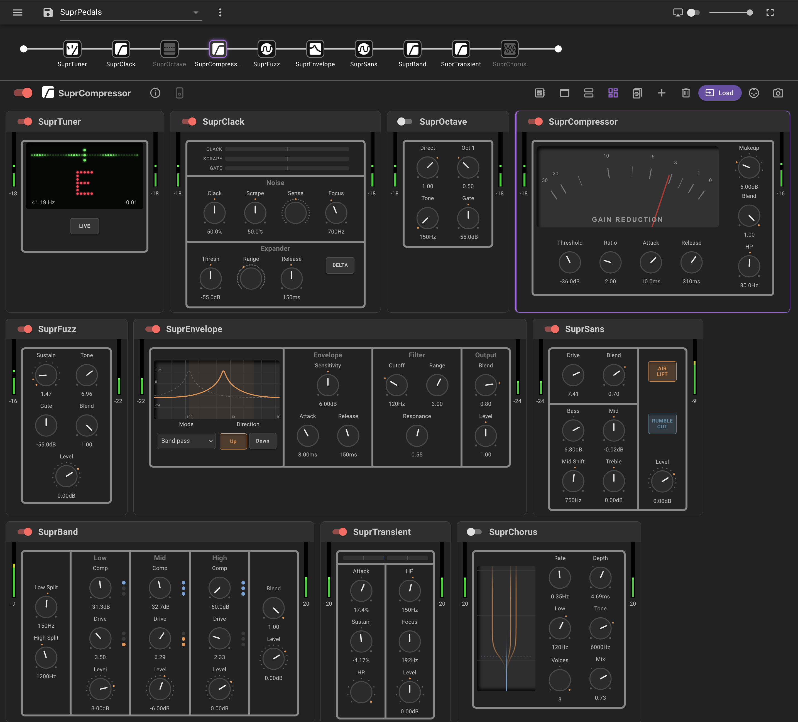

# SuprPedals

SuprPedals is a collection of thirteen bass-focused LV2 plugins for Raspberry
Pi and [PiPedal](https://rerdavies.github.io/pipedal/). It covers pitch,
dynamics, drive, modulation, metering and multi-model NAM routing.



The plugins work in a standard LV2 host. Their custom panels, meters and plots
are part of the companion [PiPedal fork](https://github.com/SuprDuprNatural/pipedal).

## Plugins

| Plugin | Purpose |
| --- | --- |
| **SuprOctave** | OC-2-style sub octave with adaptive bass tracking |
| **SuprOctavePlus** | SuprOctave plus a two-oscillator monophonic synth driven by the string rather than MIDI |
| **SuprEnvelope** | Bass envelope filter with LP, BP and HP modes, reverse sweep and dry blend |
| **SuprCompressor** | Clean soft-knee compressor with sidechain high-pass, parallel blend and gain-reduction output |
| **SuprTransient** | Attack and sustain shaper measured against an SPL Transient Designer; Focus protects the fundamental |
| **SuprClack** | Reduces fret clack, scrapes, sympathetic ring, shift noise and noise between notes |
| **SuprBand** | Phase-coherent three-band compression and drive with a clean low end |
| **SuprVU** | Stereo passthrough VU meter with 300 ms ballistics and peak indicators |
| **SuprTuner** | Chromatic strobe tuner designed for 18–500 Hz |
| **SuprSans** | Bass driver and DI preamp fitted to measurements of a SansAmp Bass Driver |
| **SuprFuzz** | Two-stage bass fuzz fitted to Big Muff for Bass captures, with an aligned clean blend |
| **SuprChorus** | Crossover chorus that leaves the band below `Low` unmodulated |
| **SuprNAM** | Up to three `.nam` or `.aidax` models in seven series and parallel routings |

## Build and install

The first twelve plugins are dependency-free apart from the included LV2
header:

```sh
sudo apt install build-essential
make
sudo make install
sudo systemctl restart pipedald
```

SuprNAM uses NeuralAudio, NAM Core, RTNeural and Eigen, so it has a separate
CMake build:

```sh
sudo apt install build-essential cmake lv2-dev pkg-config
git submodule update --init --recursive
make nam SUPR_CPU=cortex-a72
sudo make nam-install
sudo systemctl restart pipedald
```

Use `SUPR_CPU=cortex-a76` on a Pi 5. On a 4 GB board, add `NAM_JOBS=2` to keep
the first build within memory. One normal NAM model uses about 46% of a Pi 4
core; enable **Threaded** when using two or three models.

Installing new plugins or changing ports can reset values in a saved
pedalboard. Save the board first and check its controls after the restart.

## Develop and test

The normal gate is quick and runs without LV2 or audio hardware:

```sh
make test       # build and run the offline DSP suite
make demo       # render example WAV files to build/demo/
make tools      # build the capture-measurement probe
make nam-test   # SuprNAM graph, LV2 host and optional real-model checks
```

`make test` checks tracking, reconstruction, nulls, level laws, block-size
independence, latency and common failure cases. Run it after every DSP or port
change. The test harness can also process real recordings; the available
`--wav*` modes are in `test/test_octaver.cpp`.

The DSP classes live in `src/*.h`. Each small LV2 wrapper in `src/Supr*.cpp`
maps ports to one of those classes, and the matching metadata is in `ttl/`.
Port indices in the wrapper and TTL are two hand-maintained copies of the same
interface, so keep them contiguous and in exactly the same order.

## Design constraints

- Mono input and output except for the stereo SuprVU.
- No allocation or locking in the audio callback.
- Neutral controls collapse to an exact or measured identity wherever the
  signal topology allows it.
- Parallel and dry paths are sample-aligned before they are mixed.
- Plugin-specific displays read control or output ports from the DSP instead
  of estimating the same state in the browser.

Reported fixed latency:

| Plugins | Latency |
| --- | --- |
| Octave, OctavePlus, Envelope, Compressor, Transient, VU, Tuner, Chorus | 0 samples |
| Sans, Fuzz, Band | 15 samples from the 2× halfband round trip |
| Clack | 2 ms lookahead |
| NAM | 0 inline; one host block when Threaded |

The chorus delay is the effect itself, not a delay on its dry path.

## Documentation

- [DSP design notes](docs/DESIGN_NOTES.md) — important algorithms,
  measurements and trade-offs.
- [SuprClack](docs/SUPRCLACK.md) — the cleanup pedal in enough detail to
  change it safely.
- [Supr design and hardware UI](docs/SUPRDESIGN.md) — custom PiPedal faces,
  shared controls, live displays and the implemented OLED path.

Operational build and Pi deployment notes are in [AGENTS.md](AGENTS.md).

## License

MIT. See [LICENSE](LICENSE).
